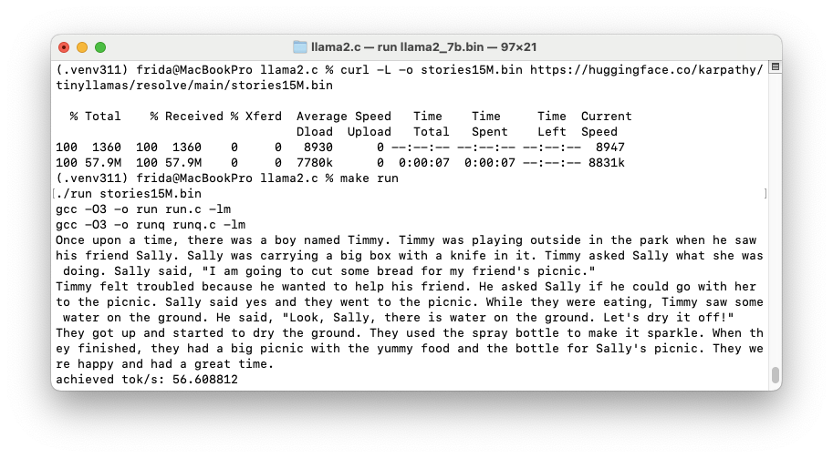
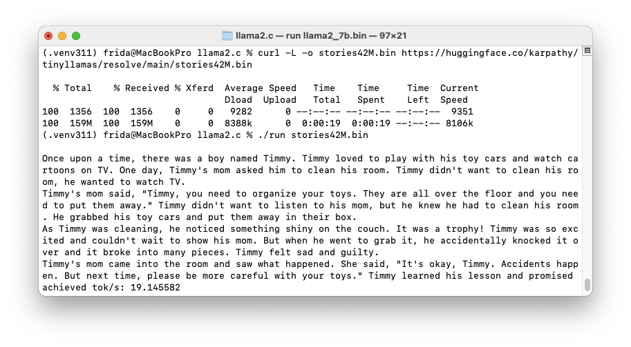
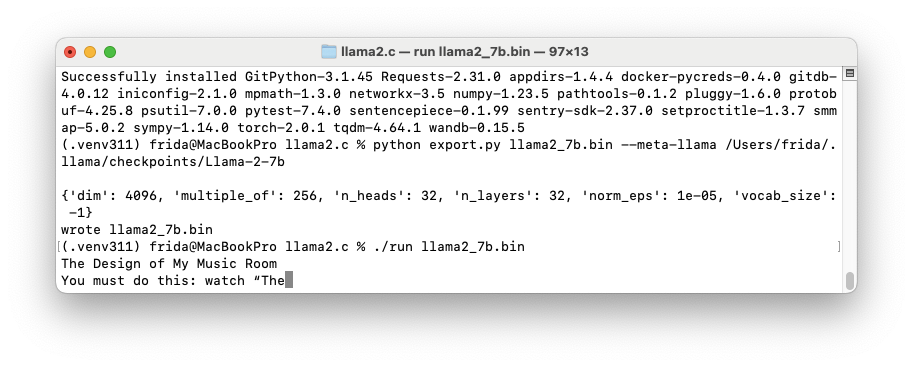
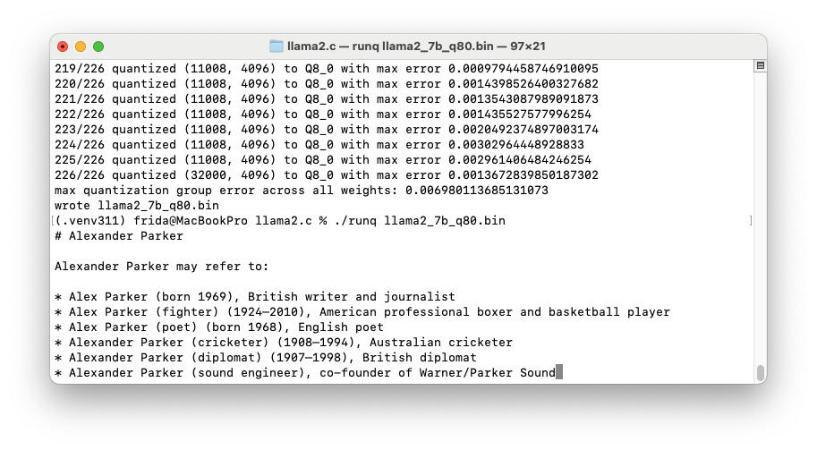
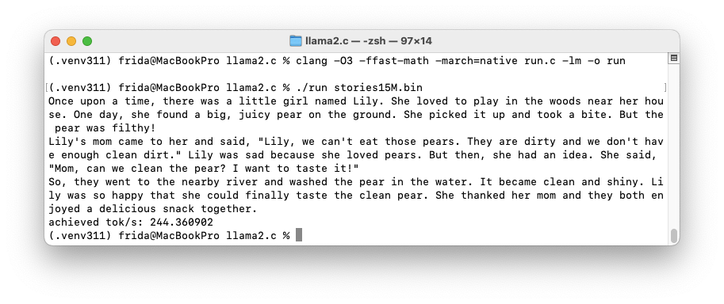

# Week 01 – Assignment


## 📘 Q1. Modal
**Description**: Read through these sections of the modal.com documentation and run the examples.
**Source Code**: [hello_world.py](./hello_world.py)  

## 📘 Q2. llama2.c
**Description**: - Read through and understand the README file thoroughly.
- Run the commands under the following sections on your CPU machine:
    - 
    - 
    - 
    - 
    - 

## 📘 Q3. Single-threaded Matrix Multiply
**Description**: Implement a single-threaded version in C.  

**Source Code**: [single_thread.c](./single_thread.c)

**How to run**:
```bash
# macOS
gcc -O2 -std=c11 -Wall -Wextra single_thread.c -o single_thread && ./single_thread 
```

## 📘 Q4. Multi-threaded Matrix Multiply with pthreads
**Description**: Implement a multi-threaded version in C using pthreads.
**Source Code**: [multi_thread.c](./multi_thread.c) 
**How to run**:
```bash
# macOS
gcc -O2 -std=c11 -Wall -Wextra -pthread multi_thread.c -o multi_thread
./multi_thread 
```